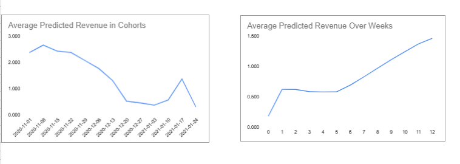
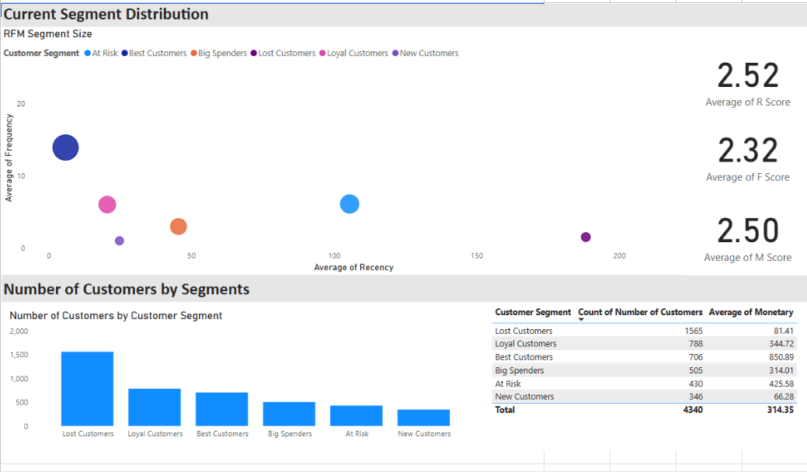

# CLV and RFM Analysis
---
## Overview

## Task 1

The aim of this project is to assess how much revenue a customer generates throughout their relationship with the company. The task was to calculate Customer Lifetime Value (CLV) using the provided data and to evaluate the sustainability of the current marketing expenditure.

### Key Steps

1. **Inclusive User Analysis:**
   -  Considered all visitors, not just purchasers.

2. **Cohort and Revenue Analysis:**
   - Extracted first interaction weeks to form registration cohorts.
   - Aligned weekly purchase data with cohorts to calculate Average Revenue per User (ARPU).

3. **Cumulative Revenue Visualization:**
   - Developed charts showing cumulative revenue growth, aiding trend analysis and forecasting.

4. **Predictive Revenue Modeling:**
   - Estimated future revenue for newer cohorts using cumulative growth percentages.

This detailed analysis provides a more complete understanding of user behavior and enhances our ability to predict customer lifetime value trends.   

---
## Task 2

The goal of this project is to analyse customer data for the specific timeline using the RFM (Recency, Frequency, Monetary) model. 

### Key Steps

1. **Data Selection and Calculation:**
   - Utilize SQL to select and process the data.
   - Calculate recency, frequency, and monetary values, converting these to R, F, and M scores based on quartiles using the `APPROX_QUANTILES` function in BigQuery.

2. **RFM Scoring:**
   - Calculate recency from the reference date.
   - Derive a common RFM score to rank customers, referring to example outcomes.

3. **Customer Segmentation:**
   - Categorize customers into segments such as Best Customers, Loyal Customers, Big Spenders, Lost Customers, and other groups.

4. **Visualization and Insights:**
   - Create a dashboard to present the analysis using tools like Power BI.
   - Provide insights on which customer groups the marketing team should prioritize.

This framework helps identify valuable customer segments and guides strategic marketing efforts.   

---

## 🛠️ Methodology

### Data Processing

The link for the SQL query: [Add SQL Query Link Here]

## 📈 Results & Visualizations

### 1. Task1

 
 

 
### 2.Task 2

 
 